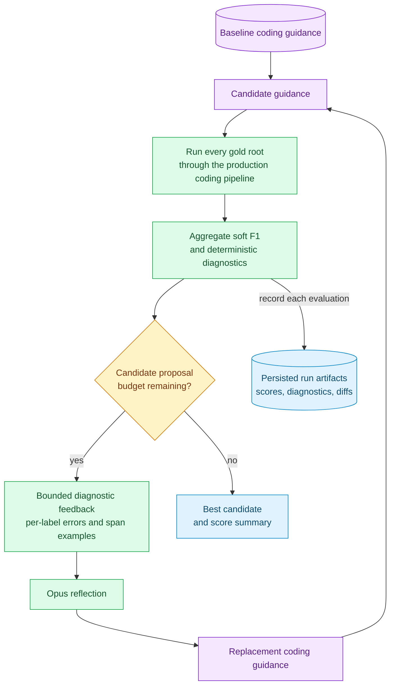
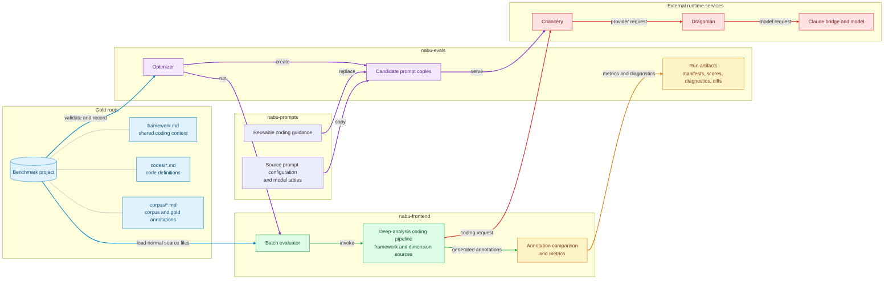
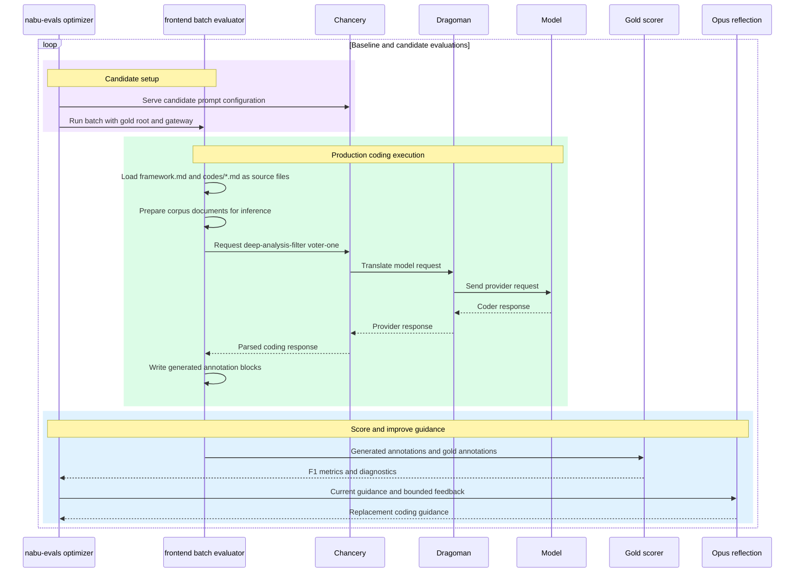

# Evaluation flows

These diagrams explain how the coding-guidance optimizer evaluates and improves a prompt. A **gold root** is a benchmark project in the same shape the application normally reads: shared framework context, individual code definitions, and annotated corpus documents.

## Figure 1: The optimization loop

This is the top-level mental model: the evaluator searches for better coding guidance by measuring a baseline and successive replacements against the gold roots. Each measurement is preserved as an artifact, while bounded error evidence informs the next proposal. The candidate-proposal budget is the stopping rule; the result is the best measured candidate rather than an automatically proven optimum. [Figure 2](#figure-2-where-the-loops-artifacts-live) places these named pieces in their repositories and services.

## Figure 2: Where the loop's artifacts live

[Figure 1](#figure-1-the-optimization-loop) establishes the roles; this map establishes their ownership. The benchmark’s files are regular coding inputs for the frontend, while nabu-evals supplies orchestration and records results. Prompt source material and candidate copies are served through the normal prompt/runtime path, so each score reflects the production coding pipeline. With those boundaries in mind, [Figure 3](#figure-3-inside-run-every-gold-root) follows one evaluation through that path.

## Figure 3: Inside “run every gold root”

[Figure 2](#figure-2-where-the-loops-artifacts-live) locates the participants; this sequence zooms into one candidate evaluation. The frontend loads the benchmark’s framework and code files as ordinary source files, prepares its corpus, and sends the coding request through the normal model gateway. The scorer compares the returned annotations with gold annotations and returns the metrics and diagnostic evidence that drive the next proposal in the optimization loop.

